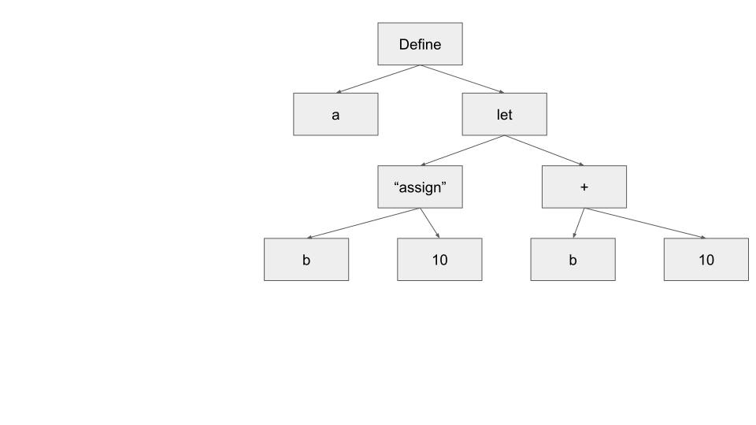

title: On writing an interpreter
date: 2026-07-27


# On writing an interpreter
## What is an interpreter? 
Programming languages can be split into many different axes, and you've probably
heard of a couple of them. The difference that matters here is compiled vs
interpreted. A compiled language is read by a compiler, which transforms your
program into machine code to later be executed. An interpreter on the other
hand, is a program which, very meta, runs a program in the language of choice. A
common example of an interpreted language is python. If we write a program
```python
def main():
  print ("hello!")
```

save it into a file hello.py, and then run `python hello.py` in the command
line, the program python will read the lines in our program, and directly run
our program, producing the output "hello." One of the beauties of lisp is that
it's easy, and we'll explain why in a bit, to build interpreters for. In fact,
even though the task may seem daunting, the introductory book Structure and
Interpretation of Computer Programs[^1], builds up to a very simple interpreter.
I have some time on my hands, and I wanted to learn more about programming
languages, so I gave a shot at building one.

## What's the outline to building an interpreter?
There's roughly 3 stages to writing an interpreter: 

1. Tokenization
2. Building an abstract syntax tree (AST)
3. Evaluating the abstract syntax tree. 

It feels unfair to split these three as such, since the third step is by far the
largest. Now that we know the names of each step, let's actually do the darn thing. 

### Tokenization
In this step we want to break down the program into the smallest syntactical
elements -- that is, to the smallest elements with any meaning. We refer to
these units as tokens[^2]. Similar to the English language, our program'gs
smallest elements are the words, broken up by spaces, and since we're talking
about lisp, also parentheses. For example, if we have:

``` lisp
(define x a)
```

we want our tokenized program to be:
``` python
['define', 'x', a]
```
We mostly do this step to make the AST easier to build, and to remove any non-syntactical elements from our program, such as comments and white space. This step is otherwise mostly mechanical.

### AST
Now let's learn about Abstract Syntax Trees! First, let's start by looking at an example. Let's say we have the simple program:
```lisp
(define a
    (let ((b 10))
        (+ b 10)))
```

(This is a contrived program, it doesn't do anything useful lol).
We'll then have the syntax tree:

```
[['define', 'a', ['let', [['b', '10']], ['+', 'b', '10']]]]
```
Or graphically:



[^1]: If you haven't given it a read, I recommend it! It's a great book. I'll explain some lisp here, but if you want to learn more I recommend giving this book a read.

[^2]: You might have heard about this term now with the AI craze. Tokens there are still a small sytntactical element, but they aren't necissarily a word. AIs work differently to humans and can sometimes understand things in larger chunks.
